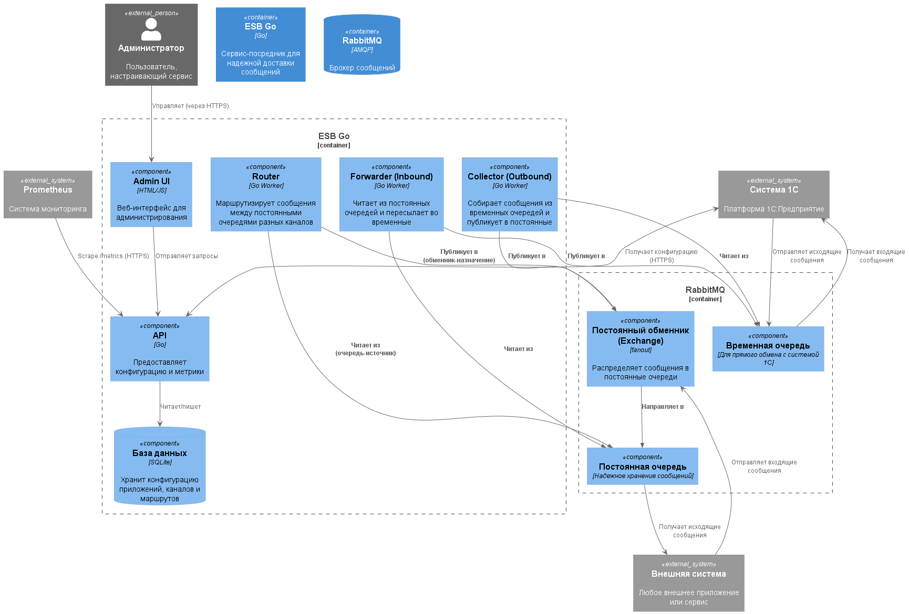

# ESB Go App

Сервис управления очередями RabbitMQ с использованием объектов 1с СервисИнтеграции.
Сервис позволяет настраивать маршрутизацию сообщений. Сообщения могут дополнительно трансформироваться с помощью скриптов `java script`, `starlark (python)`. Сервис может получать сообщения обращаясь по `http` к сторонним api по расписанию.

Проект получил жизнь благодаря идеям полученным от Vladimir Nadulich и его разработке на Python [фейк-сервер](https://github.com/240596448/esb1c-fake-api).
Проект реализован на Golang и значительно функционально расширен по сравнению с оригиналом.

[Руководство по развертыванию и настройке](./docs/guide.md)

